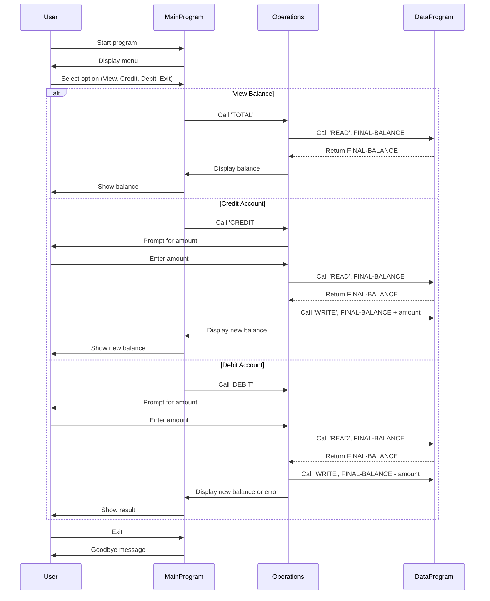

- All operations are modularized for clarity and maintainability.
+ All operations are modularized for clarity and maintainability.

## Sequence Diagram

# COBOL Programs Documentation

This project contains COBOL source files for a simple student account management system, with NAU-specific business rules. Below is an overview of each file and its key functions.

## File Overview

### main.cob
**Purpose:**
- Serves as the entry point for the Account Management System.
- Presents a menu to the user for viewing balance, crediting, debiting, or exiting.
- Handles user input and delegates operations to the `Operations` program.

**Key Functions:**
- Displays the main menu and processes user choices.
- Calls the `Operations` program with the selected operation type (`TOTAL`, `CREDIT`, `DEBIT`).
- Controls the main program loop and exit condition.

**NAU-Specific Business Rules:**
- Only allows valid menu choices (1-4).
- Ensures the user can repeatedly perform actions until they choose to exit.

---

### operations.cob
**Purpose:**
- Implements the core logic for account operations: viewing balance, crediting, and debiting.
- Interacts with the `DataProgram` to read and update the account balance.

**Key Functions:**
- Receives the operation type from `main.cob`.
- For `TOTAL`: Reads and displays the current balance.
- For `CREDIT`: Accepts an amount, adds it to the balance, and updates storage.
- For `DEBIT`: Accepts an amount, checks for sufficient funds, subtracts from the balance if possible, and updates storage.
- Handles insufficient funds for debit operations.

**NAU-Specific Business Rules:**
- Initial balance is set to 1000.00.
- Debit operations are only allowed if sufficient funds are available.
- All balance changes are persisted via `DataProgram`.

---

### data.cob
**Purpose:**
- Manages persistent storage of the account balance.
- Provides read and write operations for the balance.

**Key Functions:**
- For `READ`: Returns the current stored balance.
- For `WRITE`: Updates the stored balance with a new value.

**NAU-Specific Business Rules:**
- Initial storage balance is set to 1000.00.
- Only two operations are supported: `READ` and `WRITE`.

---

## Summary
- The system is designed for student account management, with a focus on simple credit, debit, and balance inquiry operations.
- NAU-specific rules include an initial balance of 1000.00 and prevention of overdrafts.
- All operations are modularized for clarity and maintainability.
